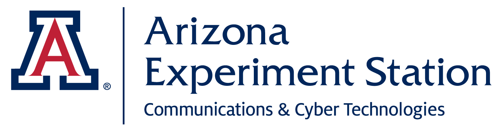

# FAIR projects dashboard

🪶 A lightweight dashboard to track the [FAIRness](https://fair-software.eu) of an organization's projects on GitHub

## Installation

We tried to make the setup as simple as possible:

1. Fork the repo.
2. Edit the configuration in [config.toml](./config.toml).
4. Set up GitHub pages to deploy from GitHub Actions.
5. Activate the GitHub action.

## Contributing & License

This project was made by the [ODISSEI SoDa team](https://github.com/sodascience) based on earlier work by Utrecht University's [Centre for Digital Humanities](https://cdh.uu.nl/), specifically the [fair-dash](https://github.com/CentreForDigitalHumanities/fair-dash) repo.

Feel free to edit, remix, and make your own, but please acknowledge both the SoDa team and the UU CDH!

## Contact
This is a project by the [ODISSEI Social Data Science (SoDa)](https://odissei-data.nl/nl/soda/) team with modifications by [CCT Data Science](https://datascience.cct.arizona.edu/).
Do you have questions, suggestions, or remarks on the technical implementation? File an issue in the
issue tracker or feel free to contact [Erik-Jan van Kesteren](https://github.com/vankesteren).

 

